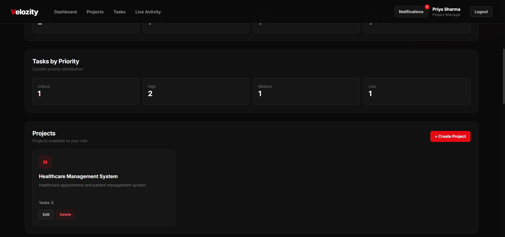
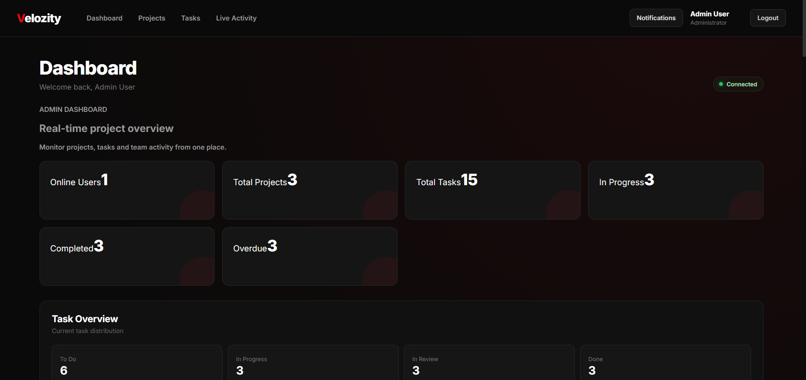
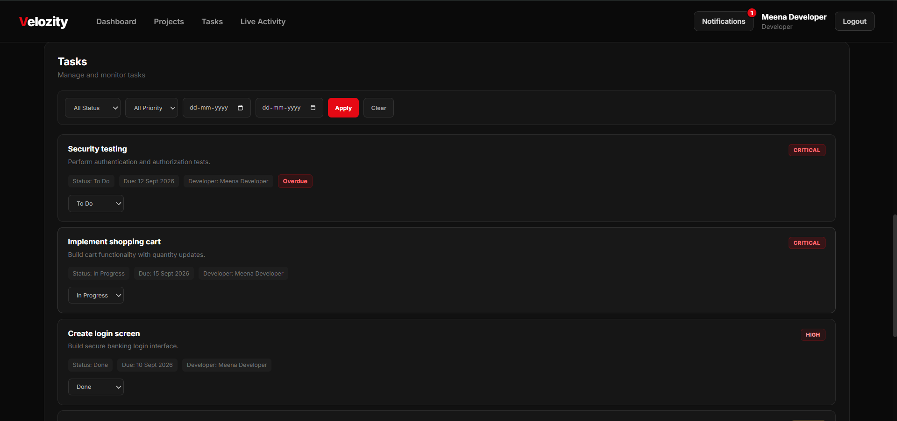

<div align="center">

# Velozity Dashboard

### A Modern Project & Task Management Dashboard

<p>
  <strong>Manage projects • Assign tasks • Control access • Track progress</strong>
</p>

<br>

[](https://github.com/jasminefloraa/Velozity-Dashboard)

</div>

---

## About The Project

**Velozity Dashboard** is a full-stack project management platform designed to simplify project and task management through a centralized dashboard.

The application provides role-based access for **Project Managers** and **Developers**, allowing teams to organize projects, manage tasks, control project access, and track work efficiently.

> Built as part of a **Software Developer Internship Assignment**.

---

## Key Features

<table>
<tr>
<td width="50%">

### Authentication

Secure user authentication with protected application resources.

</td>
<td width="50%">

### Role-Based Access

Different capabilities for Project Managers and Developers.

</td>
</tr>

<tr>
<td width="50%">

### Project Management

Create, manage, and organize projects from a centralized dashboard.

</td>
<td width="50%">

### Task Management

Create, assign, update, and track project tasks.

</td>
</tr>

<tr>
<td width="50%">

### Developer Access

Control which developers can access specific projects.

</td>
<td width="50%">

### Dashboard

View projects and tasks through a clean and organized interface.

</td>
</tr>
</table>

---

## User Roles

### Admin

Admins can:

* Manage users and user roles
* Manage projects and tasks
* Monitor overall project activity
* Control access and permissions across the application

### Project Manager

Project Managers can:

* Create and manage projects
* Create and manage tasks
* Assign tasks to developers
* Manage developer project access
* Monitor project and task progress

### Developer

Developers can:

* View accessible projects
* View assigned tasks
* Update task status
* Work on tasks based on their permissions

---

## Tech Stack

<div align="center">

### Frontend


### Backend


### Database


### ORM


### Real-Time Communication


### Authentication


### Tools


### Deployment


</div>

---


## Application Flow

```text
                         ┌──────────────────────┐
                         │   Velozity Dashboard │
                         └──────────┬───────────┘
                                    │
                         ┌──────────▼───────────┐
                         │   Authentication     │
                         └──────────┬───────────┘
                                    │
                    ┌───────────────┴───────────────┐
                    │                               │
            ┌───────▼────────┐             ┌────────▼───────┐
            │ Project Manager │             │    Developer   │
            └───────┬────────┘             └────────┬───────┘
                    │                               │
          ┌─────────▼─────────┐             ┌────────▼────────┐
          │ Project Management│             │ Accessible      │
          │ Task Management   │             │ Projects & Tasks│
          │ Access Management │             │ Status Updates  │
          └───────────────────┘             └─────────────────┘
```

---

## Project Structure

```text
Velozity-Dashboard/
│
├── frontend/
│   ├── components/
│   ├── pages/
│   ├── services/
│   └── ...
│
├── backend/
│   ├── controllers/
│   ├── models/
│   ├── routes/
│   ├── middleware/
│   └── ...
│
├── README.md
└── ...
```

---

## Authentication & Security

The application uses authentication and authorization mechanisms to protect application resources.

Security considerations include:

* Protected application resources
* Role-based authorization
* Project-level access control
* Environment variables for sensitive configuration
* Backend validation of user permissions
* Protected API endpoints

> **Note:** Environment files containing secrets should never be committed to the repository.

---

## Getting Started

### Prerequisites

Make sure the following are installed:

* Node.js
* npm
* MongoDB
* Git

### Clone Repository

```bash
git clone https://github.com/jasminefloraa/Velozity-Dashboard.git
cd Velozity-Dashboard
```

### Install Dependencies

Install the dependencies for the frontend and backend according to the project structure.

```bash
npm install
```

### Environment Variables

Create the required environment file and configure your local values.

Example:

```env
PORT=5000
MONGODB_URI=your_mongodb_connection_string
JWT_SECRET=your_jwt_secret
```

### Run the Application

Start the backend and frontend development servers according to the project configuration.

---

## Demo Credentials

Use the following demo accounts to explore the different role-based features of the application.

> **Demo Password:** `Demo@12345`

| Role                | Username             | Password     |
| ------------------- | -------------------- | ------------ |
| **Admin**           | `admin@velozity.com` | `Demo@12345` |
| **Project Manager** | `pm1@velozity.com`   | `Demo@12345` |
| **Project Manager** | `pm2@velozity.com`   | `Demo@12345` |
| **Developer**       | `dev1@velozity.com`  | `Demo@12345` |
| **Developer**       | `dev2@velozity.com`  | `Demo@12345` |
| **Developer**       | `dev3@velozity.com`  | `Demo@12345` |
| **Developer**       | `dev4@velozity.com`  | `Demo@12345` |

### Live Application

**Frontend:** https://velozity-dashboard-puce.vercel.app/

These credentials are provided for **internship evaluation and demonstration purposes**.

---

## Testing

The application can be tested across the following areas:

| Area           | Testing                         |
| -------------- | ------------------------------- |
| Authentication | Login and logout                |
| Authorization  | Role-based access               |
| Projects       | Create and manage projects      |
| Tasks          | Create, assign and update tasks |
| Access Control | Developer project permissions   |
| API            | Backend endpoint testing        |
| UI             | Dashboard and user interactions |

---

## Screenshots

<div align="center">

### Dashboard

<!-- Add your dashboard screenshot here -->



<br><br>

### Project Management

<!-- Add your project screenshot here -->




### Task Management

<!-- Add your task screenshot here -->



</div>


---

## Future Improvements

* Real-time notifications
* Advanced project analytics
* Activity and audit logs
* Improved dashboard visualizations
* Automated testing
* Enhanced reporting
* Performance optimization

---

## Author

### Jasmine Flora J

**B.Tech Computer Science and Engineering**

Manakula Vinayagar Institute of Technology, Puducherry

[](https://github.com/jasminefloraa)

[](https://www.linkedin.com/in/jasmine-flora/)

---

### Velozity Dashboard

**Built with React, Node.js, Express & MongoDB**

This project was developed for educational and internship evaluation purposes.
